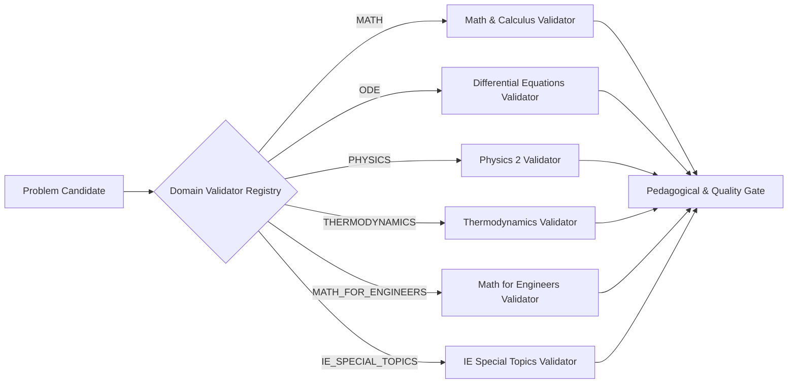

# Domain Validation Architecture Specification

## Deterministic & Pedagogical Multi-Domain Quality Verification

---

## 1. Domain Validation Dispatcher

The engine routes every generated candidate to a dedicated `DomainValidator` registered inside `DomainValidatorRegistry` before executing general content and pedagogical checks:

---

## 2. Domain-Specific Verification Engines

### 1. Calculus & Symbolic Mathematics (`MathValidator`)
- **Engine Rules**:
  - Validates full AST well-formedness and absence of undefined variables.
  - Independently evaluates derivative using `Differentiator` and verifies symbolic canonical solution against AST through `EquivalenceEngine`.
  - Enforces singularity safety: flags explicit or removable division by zero ($\pm \infty$).

### 2. Differential Equations (`ODEValidator`)
- **Engine Rules**:
  - **Syntax Check**: Enforces presence of differential operators (`dy/dx`, `y'`, `y''`).
  - **Classification Check**: Asserts order and linearity definitions match canonical taxonomic rules.
  - **Solution Substitution Verification**: Ensures explicit or implicit solution satisfies original differential relation:
    $$L[y(x)] = g(x)$$
  - **Constant Preservation**: Ensures arbitrary constants of integration ($C, C_1, C_2$) are retained in general solutions.

### 3. Physics 2 (`PhysicsValidator`)
- **Engine Rules**:
  - **Physical Unit Homogeneity**: Verifies units are declared in SI or standard engineering notations ($\text{Pa}, \text{kPa}, \text{A}, \text{V}, \Omega, \text{W}, \text{N}$).
  - **Physical Realism Invariants**:
    - Linear DC resistor networks: $R > 0\ \Omega$.
    - Speed of light and wave propagation: $v \le c$.
    - Absolute hydrostatic pressure: $P_{\text{abs}} \ge 0\text{ Pa}$.

### 4. Thermodynamics (`ThermodynamicsValidator`)
- **Engine Rules**:
  - **Third Law of Thermodynamics**: Absolute temperature $T > 0\text{ K}$.
  - **State Postulate & Table Boundaries**: Ensures specified state lies within legitimate property ranges (e.g. quality $0 \le x \le 1$ in saturated mixture).
  - **First Law Closed System Balance**: Enforces energy conservation:
    $$Q - W = \Delta U$$
  - **Second Law Feasibility**: Thermal efficiency $\eta_{\text{thermal}} < \eta_{\text{Carnot}} = 1 - \frac{T_L}{T_H}$.

### 5. Mathematics for Engineers (`MathForEngineersValidator`)
- **Engine Rules**:
  - **Triangle Inequality**: For triangles with sides $a, b, c$, asserts $a + b > c$.
  - **Trigonometric Range Bounds**: $|\sin \theta| \le 1$, $|\cos \theta| \le 1$.
  - **Quadratic Root Verification**: Discriminant $\Delta = b^2 - 4ac$ accurately dictates real vs complex root branches.

### 6. Industrial Engineering & Engineering Economy (`IESpecialTopicsValidator`)
- **Engine Rules**:
  - **Time Value of Money**: Interest rates $i > 0$, project periods $n \ge 1\text{ year}$.
  - **Asset Depreciation Invariants**: Salvage value $S \le \text{Initial Cost } C$.
  - **Benefit-Cost Feasibility Decision Rule**: Project economically viable if and only if $B/C \ge 1.0$.

---

## 3. General Content & Pedagogical Quality Gates

In addition to domain-specific mathematical rules, all candidates must pass:

1. **Syntax & AST Integrity**: No empty strings or missing expressions.
2. **Skill Alignment**: Primary skill ID exists in authoritative Curriculum Registry.
3. **Evidence Alignment**: Evidence type matches student observable behavior rubric.
4. **Hint Anti-Leakage (L1 to L3)**: Preliminary hints must never disclose final answer LaTeX.
5. **Distractor Plausibility**: Multiple choice options must contain authentic misconceptions with explanations.
