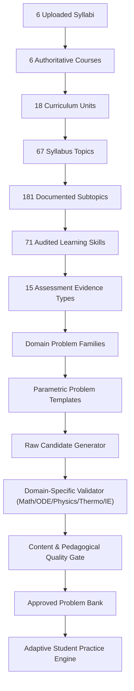

# Six-Course Content Architecture Specification

## Engineering Practice Engine — Phase 4 Authoritative Foundation

---

## 1. Executive Architecture Summary

The Engineering Practice Engine content architecture is designed from first principles to support the **entire six-course engineering curriculum** derived from the authoritative syllabi:

1. **GEN 0101** — *Mathematics for Engineers* (17 Learning Skills)
2. **GEN 0102** — *Calculus 1* (15 Learning Skills — Active Calibrated Pilot Slice)
3. **GEN 0107** — *Differential Equations* (11 Learning Skills)
4. **GEN 0110** — *Physics 2 for Engineers - Lec/Lab* (10 Learning Skills)
5. **GEN 0161** — *Thermodynamics* (8 Learning Skills)
6. **BSIE 3219** — *IE Special Topics 1* (10 Learning Skills)

> **Key Architectural Mandate**: Calculus 1 is the pilot slice, **not the product scope**. The shared engine infrastructure supports all six domains through domain-neutral interfaces paired with domain-specific validation engines.



---

## 2. Common Abstract Architecture vs Domain Specialization

To prevent brittle monolithic schemas or forcing non-symbolic domains into calculus-shaped structures, the system separates **shared pipeline infrastructure** from **domain generation logic**:

| System Component | Shared Core Infrastructure | Domain Specialization Point |
| :--- | :--- | :--- |
| **Problem DNA** | Provenance IDs, Difficulty Vector (8D), Guidedness, Lifecycles, Signatures | `domainValidatorType`, domain-specific representation |
| **Statement** | Prompt text, LaTeX formatting, variable naming | Given work (Error Analysis), Circuit Schematics, State Diagrams, Physical Units |
| **Solution** | Step trace hierarchy, reasoning phases, whyMethodRequired | Symbolic calculus step generator, ODE separation solver, Thermo state balance, Economy cash flow table |
| **Hints** | 5-tier scaffolding progression (L1 to L5) | Formula recall, state tables, physical law reminders |
| **Validation** | Anti-leakage, singularity safety, option validity | AST algebraic equivalence, unit consistency, ODE substitution, Thermo phase boundary check, Financial rate sanity |

---

## 3. End-to-End Problem Provenance Contract

Every problem generated by the engine maintains an unbroken, immutable lineage:

$$\text{Problem DNA} \xrightarrow{\text{instantiates}} \text{Template} \xrightarrow{\text{belongs to}} \text{Family} \xrightarrow{\text{evidences}} \text{Skill} \xrightarrow{\text{subtopic of}} \text{Topic} \xrightarrow{\text{unit of}} \text{Course} \xrightarrow{\text{extracted from}} \text{Syllabus}$$

```typescript
export interface ProblemDNA {
  problemId: string;
  courseId: string;
  topicId: string;
  subtopicId: string;
  primarySkillId: string;
  supportingSkillIds: string[];
  evidenceType: AssessmentEvidenceTypeId;
  familyId: string;
  templateId: string;
  representationType: ContentRepresentationType;
  contextType: ContentContextType;
  guidedness: GuidednessLevel;
  difficultyVector: DifficultyVector;
  structureSignature: string;
  misconceptionTarget?: string;
  isRemediationRepetition?: boolean;
  domainValidatorType: DomainValidatorType;
  curriculumVersion: string;
  skillOntologyVersion: string;
  generatorVersion: string;
  templateVersion: string;
  validatorVersion: string;
}
```

---

## 4. Lifecycle & Quality States

1. **`DRAFT`**: Generated parametric candidate before domain verification.
2. **`VALIDATING`**: Undergoing multi-stage domain and pedagogical validation.
3. **`VALID`**: Fully verified by deterministic engine and domain rules.
4. **`APPROVED`**: Teacher-calibrated and certified for high-stakes assessment.
5. **`REJECTED`**: Discarded due to singularity, domain inconsistency, or hint leakage.
6. **`ARCHIVED`**: Superseded by updated curriculum versions.
