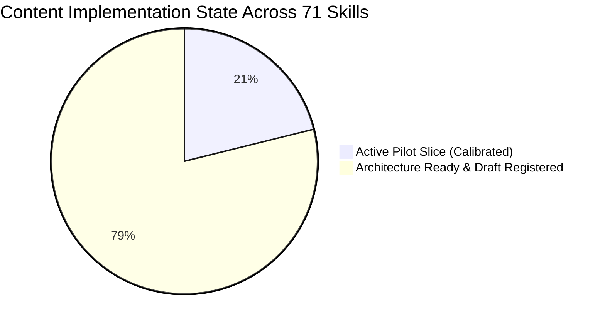

# Six-Course Content Gap Analysis & Expansion Roadmap

## Strategic Gap Audit & Implementation Milestones

---

## 1. Executive Content Readiness Breakdown

| Course ID | Course Code | Name | Total Skills | Fully Calibrated Pilot Skills | Architecture-Ready Draft Skills | Next Milestone Priority |
| :--- | :--- | :--- | :---: | :---: | :---: | :--- |
| `COURSE-GEN0102` | `GEN 0102` | Calculus 1 | 15 | **15 Skills** | 0 Skills | **Production Pilot Scale** |
| `COURSE-GEN0101` | `GEN 0101` | Mathematics for Engineers | 17 | 0 Skills | **17 Skills** | Phase 5A: Full Algebra & Trig Blueprinting |
| `COURSE-GEN0107` | `GEN 0107` | Differential Equations | 11 | 0 Skills | **11 Skills** | Phase 5B: ODE Substitution & IVP Engine |
| `COURSE-GEN0110` | `GEN 0110` | Physics 2 for Engineers | 10 | 0 Skills | **10 Skills** | Phase 5C: Circuit & Field Schematics |
| `COURSE-GEN0161` | `GEN 0161` | Thermodynamics | 8 | 0 Skills | **8 Skills** | Phase 5D: Steam Property Table Engine |
| `COURSE-BSIE3219` | `BSIE 3219` | IE Special Topics 1 | 10 | 0 Skills | **10 Skills** | Phase 5E: Licensure Economy & Optimization |

---

## 2. Detailed Gap Identification by Course

### A. GEN 0101 — Mathematics for Engineers
- **Current State**: 4 Problem Families (`OPERATIONS-STD`, `VARIATION-APP`, `TRIG-TRIANGLE`, `QUADRATIC-ROOTS`) active with parametric templates.
- **Identified Gaps**:
  - `SKILL-GEN0101-015`: Partial Fraction Decomposition generator (Linear vs Irreducible quadratic factors).
  - `SKILL-GEN0101-017`: Cramer's Rule $3 \times 3$ matrix determinant solver.
  - `SKILL-GEN0101-014`: Conic section eccentricity and focus-directrix identification.

### B. GEN 0107 — Differential Equations
- **Current State**: 3 Problem Families (`CLASSIFY-ORDER`, `SEPARABLE-STD`, `LINEAR-1ST-IF`) active with domain validator.
- **Identified Gaps**:
  - `SKILL-GEN0107-006` to `008`: Homogeneous 2nd-order characteristic equation roots ($\Delta > 0, \Delta = 0, \Delta < 0$) with complex exponential solutions ($e^{\alpha x}(C_1 \cos \beta x + C_2 \sin \beta x)$).
  - `SKILL-GEN0107-009` & `010`: Laplace transform table matching and Partial Fraction inversion for Initial Value Problems (IVPs).

### C. GEN 0110 — Physics 2 for Engineers
- **Current State**: 2 Problem Families (`FLUID-PRESSURE`, `DC-CIRCUITS-OHM`) active with physical unit checks.
- **Identified Gaps**:
  - `SKILL-GEN0110-006`: Multi-loop Kirchhoff's Voltage Law (KVL) and Current Law (KCL) linear equation systems.
  - `SKILL-GEN0110-007`: 2D Coulomb electrostatic vector superposition with angle trigonometry.
  - `SKILL-GEN0110-009`: Optical refraction diagram generator and thin lens equation ($1/f = 1/d_o + 1/d_i$).

### D. GEN 0161 — Thermodynamics
- **Current State**: 2 Problem Families (`STATE-PROPERTY-TABLE`, `1ST-LAW-CLOSED`) active with state validation and Third Law temperature enforcement ($T > 0\text{ K}$).
- **Identified Gaps**:
  - `SKILL-GEN0161-002`: Expanded embedded steam table dataset for interpolation across saturated liquid ($v_f, h_f$), saturated vapor ($v_g, h_g$), and superheated tables.
  - `SKILL-GEN0161-008`: Rankine vapor cycle four-state enthalpy balance ($W_{\text{turb}} = h_1 - h_2$, $W_{\text{pump}} = v(P_4 - P_3)$).

### E. BSIE 3219 — IE Special Topics 1
- **Current State**: 2 Problem Families (`COMPOUND-INTEREST`, `BENEFIT-COST-ANALYSIS`) active with economic bounds validation.
- **Identified Gaps**:
  - `SKILL-BSIE3219-004`: MACRS asset depreciation schedule tables with half-year convention.
  - `SKILL-BSIE3219-006`: Simplex tableau and graphical linear programming constraint region shading.
  - `SKILL-BSIE3219-007`: CPM/PERT network diagram forward/backward pass with Early Start (ES) and Late Start (LS).
