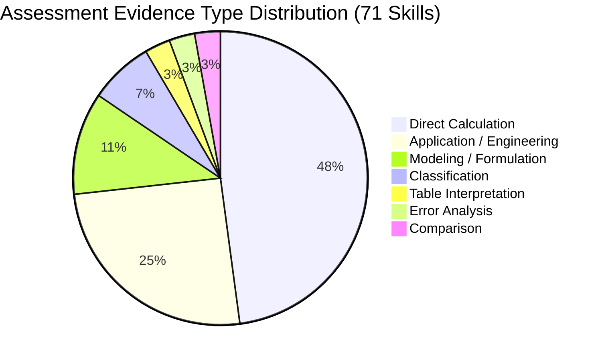

# Six-Course Curriculum Content Matrix

## Authoritative Course Coverage & Content Distribution

---

## 1. Course Distribution Overview

| Course ID | Course Code | Official Course Name | Curriculum Units | Syllabus Topics | Subtopic Nodes | Learning Skills | Active Families | Active Templates | Content Status |
| :--- | :--- | :--- | :---: | :---: | :---: | :---: | :---: | :---: | :--- |
| `COURSE-GEN0101` | `GEN 0101` | Mathematics for Engineers | 4 Units | 16 Topics | 42 Subtopics | 17 Skills | 4 Families | 4 Templates | Architecture Ready & Representative Drafts |
| `COURSE-GEN0102` | `GEN 0102` | Calculus 1 | 3 Units | 13 Topics | 37 Subtopics | 15 Skills | 10 Families | 11 Templates | **Pilot Slice & Calibrated** |
| `COURSE-GEN0107` | `GEN 0107` | Differential Equations | 3 Units | 11 Topics | 31 Subtopics | 11 Skills | 3 Families | 3 Templates | Architecture Ready & Representative Drafts |
| `COURSE-GEN0110` | `GEN 0110/ 0110L` | Physics 2 for Engineers - Lec/Lab | 3 Units | 10 Topics | 26 Subtopics | 10 Skills | 2 Families | 2 Templates | Architecture Ready & Representative Drafts |
| `COURSE-GEN0161` | `GEN 0161` | Thermodynamics | 2 Units | 8 Topics | 21 Subtopics | 8 Skills | 2 Families | 2 Templates | Architecture Ready & Representative Drafts |
| `COURSE-BSIE3219` | `BSIE 3219` | IE Special Topics 1 | 3 Units | 9 Topics | 24 Subtopics | 10 Skills | 2 Families | 2 Templates | Architecture Ready & Representative Drafts |
| **Total** | **6 Courses** | **Authoritative Engineering Suite** | **18 Units** | **67 Topics** | **181 Subtopics** | **71 Skills** | **23 Families** | **24 Templates** | **100% Curriculum Mapped** |

---

## 2. Assessment Evidence Distribution across Domains

---

## 3. Pedagogical Domain Breakdown

### GEN 0101 — Mathematics for Engineers
- **Core Foci**: Order of operations, fraction arithmetic, radical simplification, direct/inverse variation, quadratic factorization, systems of equations, right and oblique triangle trigonometry (Law of Sines/Cosines).
- **Representative Problem Families**:
  - `FAM-GEN0101-OPERATIONS-STD` (Order of Operations & Signs)
  - `FAM-GEN0101-VARIATION-APP` (Direct/Inverse Variation Modeling)
  - `FAM-GEN0101-TRIG-TRIANGLE` (Right/Oblique Triangle Elevation)
  - `FAM-GEN0101-QUADRATIC-ROOTS` (Quadratic Factoring & Roots)

### GEN 0102 — Calculus 1 (Active Calibrated Pilot Slice)
- **Core Foci**: Algebraic limits, power rule, product rule, quotient rule, chain rule, implicit differentiation, related rates, optimization, curve sketching.
- **Representative Problem Families**:
  - `FAM-GEN0102-CHAIN-POLY` (Composite Polynomial Power Chain Rule)
  - `FAM-GEN0102-CHAIN-TRIG` (Composite Trigonometric Chain Rule)
  - `FAM-GEN0102-CHAIN-ERROR` (Chain Rule Error Analysis)
  - `FAM-GEN0102-CHAIN-RECOG` (Differentiation Method Recognition)
  - `FAM-GEN0102-CHAIN-APP` (Kinematics Instantaneous Velocity Application)
  - `FAM-GEN0102-POWER-STD`, `PRODUCT-STD`, `QUOTIENT-STD`, `LIMITS-ALG`, `TANGENT-APP`

### GEN 0107 — Differential Equations
- **Core Foci**: Order & linearity classification, separable variables, first-order linear integrating factor, homogeneous linear second-order equations, Laplace transforms, mixing tank models.
- **Representative Problem Families**:
  - `FAM-GEN0107-CLASSIFY-ORDER` (ODE Order & Linearity Taxonomy)
  - `FAM-GEN0107-SEPARABLE-STD` (Separable Differential Equations)
  - `FAM-GEN0107-LINEAR-1ST-IF` (Integrating Factor First-Order Linear ODEs)

### GEN 0110 — Physics 2 for Engineers - Lec/Lab
- **Core Foci**: Hydrostatic pressure ($P = \rho g h$), buoyant forces, Fourier heat conduction, Coulomb's electrostatic force, DC resistor networks, Ohm's law, Snell's law of refraction.
- **Representative Problem Families**:
  - `FAM-GEN0110-FLUID-PRESSURE` (Hydrostatic Column Pressure Calculation)
  - `FAM-GEN0110-DC-CIRCUITS-OHM` (Series-Parallel Resistor Current Analysis)

### GEN 0161 — Thermodynamics
- **Core Foci**: Pure substance phase identification, steam table property lookup ($v, u, h, s$), First Law closed system balances ($Q - W = \Delta U$), ideal gas process boundary work, Carnot cycle efficiency.
- **Representative Problem Families**:
  - `FAM-GEN0161-STATE-PROPERTY-TABLE` (Water Phase & Enthalpy Extraction)
  - `FAM-GEN0161-1ST-LAW-CLOSED` (Stationary System Heat & Work Balance)

### BSIE 3219 — IE Special Topics 1
- **Core Foci**: Single-payment compound interest ($F = P(1+i)^n$), uniform series present worth, straight-line/MACRS depreciation, benefit-cost ratio evaluation, linear programming formulation.
- **Representative Problem Families**:
  - `FAM-BSIE3219-COMPOUND-INTEREST` (Single Payment Future Worth)
  - `FAM-BSIE3219-BENEFIT-COST-ANALYSIS` (Benefit-to-Cost Project Justification)
