# Prerequisite Dependency Graph (DAG)

**Engineering Practice Engine — Learning Competency Prerequisite Architecture**  
**Document Revision**: 1.0.0  
**Date**: August 28, 2026  
**Total Directed Edges**: 64 Verified Relationships (0 Circular Cycles)  

---

## 1. Cross-Disciplinary Prerequisite Pipeline Overview

```mermaid
graph TD
    %% Foundational Math (GEN 0101)
    A1["SKILL-GEN0101-001<br/>Real Arithmetic"] --> A2["SKILL-GEN0101-002<br/>Factorization & GCD"]
    A2 --> A3["SKILL-GEN0101-003<br/>Fractions"]
    A3 --> A4["SKILL-GEN0101-004<br/>Variation Models"]
    A1 --> A5["SKILL-GEN0101-005<br/>Algebraic Factoring"]
    A1 --> A6["SKILL-GEN0101-006<br/>Exponent Laws"]
    A5 --> A7["SKILL-GEN0101-007<br/>Applied Word Problems"]
    A5 & A6 --> A8["SKILL-GEN0101-008<br/>Quadratic Equations"]
    A5 & A8 --> A9["SKILL-GEN0101-009<br/>Systems of Equations"]
    A5 --> A10["SKILL-GEN0101-010<br/>Functions & Inverses"]
    A6 & A10 --> A11["SKILL-GEN0101-011<br/>Logarithmic Equations"]
    A1 --> A12["SKILL-GEN0101-012<br/>Cartesian Coordinates"]
    A12 & A5 --> A17["SKILL-GEN0101-017<br/>Equations of Lines"]
    A8 --> A13["SKILL-GEN0101-013<br/>Right Triangles (Trig)"]
    A13 --> A14["SKILL-GEN0101-014<br/>Bearings & Elevation"]
    A13 --> A15["SKILL-GEN0101-015<br/>Oblique Triangles (Sine/Cosine)"]
    A13 --> A16["SKILL-GEN0101-016<br/>Solid Mensuration"]

    %% Calculus 1 (GEN 0102)
    A5 & A10 --> C1["SKILL-GEN0102-001<br/>Limits & Continuity"]
    A6 --> C2["SKILL-GEN0102-002<br/>Power Rule"]
    C2 --> C3["SKILL-GEN0102-003<br/>Product Rule"]
    C2 --> C4["SKILL-GEN0102-004<br/>Quotient Rule"]
    C2 & A10 --> C5["SKILL-GEN0102-005<br/>Chain Rule"]
    C5 --> C6["SKILL-GEN0102-006<br/>Inverse Trig Derivs"]
    C5 --> C7["SKILL-GEN0102-007<br/>Hyperbolic Derivs"]
    C5 & A11 --> C8["SKILL-GEN0102-008<br/>Log & Exp Derivs"]
    C3 & C5 --> C9["SKILL-GEN0102-009<br/>Implicit Differentiation"]
    C2 & C5 --> C10["SKILL-GEN0102-010<br/>Partial Derivatives"]
    C2 & C5 --> C11["SKILL-GEN0102-011<br/>Higher Order Derivs"]
    C2 & A17 --> C12["SKILL-GEN0102-012<br/>Tangent/Normal Lines"]
    C11 & A8 --> C13["SKILL-GEN0102-013<br/>Polynomial Curves"]
    C13 & A5 --> C14["SKILL-GEN0102-014<br/>Optimization"]
    C9 & A13 --> C15["SKILL-GEN0102-015<br/>Related Rates"]

    %% Differential Equations (GEN 0107)
    C11 --> DE1["SKILL-GEN0107-001<br/>Classification of ODEs"]
    C9 & A9 --> DE2["SKILL-GEN0107-002<br/>Elimination of Constants"]
    A5 & C2 --> DE3["SKILL-GEN0107-003<br/>Separation of Variables"]
    DE3 & A5 --> DE4["SKILL-GEN0107-004<br/>Homogeneous ODEs"]
    C10 --> DE5["SKILL-GEN0107-005<br/>Exact ODEs"]
    C8 & A5 --> DE6["SKILL-GEN0107-006<br/>1st Order Linear ODEs"]
    DE6 & C5 --> DE7["SKILL-GEN0107-007<br/>Bernoulli ODEs"]
    DE3 & DE6 & A7 --> DE8["SKILL-GEN0107-008<br/>Physical Modeling"]
    C11 & A5 --> DE9["SKILL-GEN0107-009<br/>Laplace Transforms"]
    DE9 & A9 --> DE10["SKILL-GEN0107-010<br/>Coupled Linear Systems"]
    A5 & DE9 --> DE11["SKILL-GEN0107-011<br/>Inverse Laplace"]

    %% Physics 2 (GEN 0110)
    A1 --> P1["SKILL-GEN0110-001<br/>Fluid Pressure & Buoyancy"]
    A1 --> P2["SKILL-GEN0110-002<br/>Heat Conduction/Radiation"]
    A1 & A5 --> P3["SKILL-GEN0110-003<br/>Calorimetry Energy Balance"]
    A1 --> P4["SKILL-GEN0110-004<br/>Thermal Expansion & Stress"]
    A11 --> P5["SKILL-GEN0110-005<br/>Acoustic Decibels & Doppler"]
    A1 --> P6["SKILL-GEN0110-006<br/>Transverse String Waves"]
    A13 & A1 --> P7["SKILL-GEN0110-007<br/>Coulomb & Gauss Laws"]
    A9 --> P8["SKILL-GEN0110-008<br/>Kirchhoff DC Circuits"]
    A13 --> P9["SKILL-GEN0110-009<br/>Snell Law & Optics"]
    A1 & A6 --> P10["SKILL-GEN0110-010<br/>Special Relativity"]

    %% Thermodynamics (GEN 0161)
    T1["SKILL-GEN0161-001<br/>Thermodynamic States/Bounds"] --> T2["SKILL-GEN0161-002<br/>First Law Closed Systems"]
    A1 --> T2
    T1 --> T3["SKILL-GEN0161-003<br/>Ideal Gas Equations"]
    A5 --> T3
    T2 & T3 --> T4["SKILL-GEN0161-004<br/>Ideal Gas Processes"]
    T1 --> T5["SKILL-GEN0161-005<br/>Steam Table Lookups"]
    T2 & T4 --> T6["SKILL-GEN0161-006<br/>Second Law & Entropy"]
    T5 & T6 --> T7["SKILL-GEN0161-007<br/>Rankine Power Cycle"]
    T7 --> T8["SKILL-GEN0161-008<br/>Reheat & Regeneration"]

    %% IE Special Topics (BSIE 3219)
    A9 --> IE1["SKILL-BSIE3219-001<br/>Matrices & Determinants"]
    A8 & A13 --> IE2["SKILL-BSIE3219-002<br/>Complex Numbers & Vectors"]
    A1 --> IE3["SKILL-BSIE3219-003<br/>Permutations & Series"]
    A12 & A8 --> IE4["SKILL-BSIE3219-004<br/>Conic Sections"]
    C2 & A8 --> IE5["SKILL-BSIE3219-005<br/>Integral Plane Areas"]
    A1 & A11 --> IE6["SKILL-BSIE3219-006<br/>Compound Interest Rates"]
    IE6 & A5 --> IE7["SKILL-BSIE3219-007<br/>Annuities & Breakeven"]
    IE6 & A1 --> IE8["SKILL-BSIE3219-008<br/>Depreciation Schedules"]
    IE7 --> IE9["SKILL-BSIE3219-009<br/>Capital Recovery & B/C"]
    A13 & IE2 --> IE10["SKILL-BSIE3219-010<br/>Statics & Kinematics"]
```

---

## 2. Traversal Invariants & Acyclicity Guarantee

The prerequisite relationship graph has been evaluated with Depth-First Search cycle detection:
* **Total Nodes (Skills)**: `71`
* **Total Edges (Prerequisites)**: `64`
* **Cycles Detected**: `0` (Strictly Acyclic Directed Acyclic Graph)
* **Maximum Transitive Depth**: `6` (e.g. `Real Arithmetic` $\rightarrow$ `Exponent Laws` $\rightarrow$ `Power Rule` $\rightarrow$ `Chain Rule` $\rightarrow$ `Implicit Diff` $\rightarrow$ `Related Rates`)
