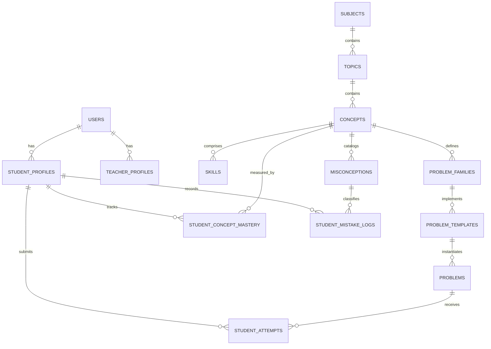

# Database Design & Schema Specification
## Engineering Practice Engine

### 1. Database Architectural Decisions
- **Database Engine**: PostgreSQL / SQLite (via Prisma ORM / Typed SQL Driver).
- **Design Philosophy**: Full relational normalization for curriculum, tracking, and attempts, paired with structured JSON fields for AST parameters and dynamic mathematical structures.
- **Auditing & Timestamps**: Strict `created_at` and `updated_at` on all stateful tables.

---

### 2. Entity-Relationship Schema



---

### 3. Core Table Definitions (SQL DDL)

```sql
-- 1. Users & Authentication
CREATE TABLE users (
    id TEXT PRIMARY KEY DEFAULT (lower(hex(randomblob(16)))),
    email TEXT UNIQUE NOT NULL,
    password_hash TEXT NOT NULL,
    full_name TEXT NOT NULL,
    role TEXT NOT NULL CHECK (role IN ('STUDENT', 'TEACHER', 'ADMIN')),
    created_at TIMESTAMP WITH TIME ZONE DEFAULT CURRENT_TIMESTAMP,
    updated_at TIMESTAMP WITH TIME ZONE DEFAULT CURRENT_TIMESTAMP
);

-- 2. Student Profiles
CREATE TABLE student_profiles (
    id TEXT PRIMARY KEY DEFAULT (lower(hex(randomblob(16)))),
    user_id TEXT UNIQUE NOT NULL REFERENCES users(id) ON DELETE CASCADE,
    current_streak INTEGER DEFAULT 0,
    best_streak INTEGER DEFAULT 0,
    total_problems_solved INTEGER DEFAULT 0,
    total_time_spent_seconds INTEGER DEFAULT 0,
    preferred_guidedness INTEGER DEFAULT 1,
    created_at TIMESTAMP WITH TIME ZONE DEFAULT CURRENT_TIMESTAMP
);

-- 3. Curriculum: Subjects, Topics, Concepts, Skills
CREATE TABLE subjects (
    id TEXT PRIMARY KEY,
    slug TEXT UNIQUE NOT NULL,
    name TEXT NOT NULL,
    description TEXT,
    sort_order INTEGER DEFAULT 0
);

CREATE TABLE topics (
    id TEXT PRIMARY KEY,
    subject_id TEXT NOT NULL REFERENCES subjects(id) ON DELETE CASCADE,
    slug TEXT UNIQUE NOT NULL,
    name TEXT NOT NULL,
    sort_order INTEGER DEFAULT 0
);

CREATE TABLE concepts (
    id TEXT PRIMARY KEY,
    topic_id TEXT NOT NULL REFERENCES topics(id) ON DELETE CASCADE,
    slug TEXT UNIQUE NOT NULL,
    name TEXT NOT NULL,
    description TEXT,
    prerequisites_json TEXT, -- array of concept IDs
    sort_order INTEGER DEFAULT 0
);

CREATE TABLE skills (
    id TEXT PRIMARY KEY,
    concept_id TEXT NOT NULL REFERENCES concepts(id) ON DELETE CASCADE,
    slug TEXT NOT NULL,
    name TEXT NOT NULL,
    description TEXT
);

-- 4. Problem Engine Catalog
CREATE TABLE problem_families (
    id TEXT PRIMARY KEY,
    concept_id TEXT NOT NULL REFERENCES concepts(id) ON DELETE CASCADE,
    code TEXT UNIQUE NOT NULL,
    name TEXT NOT NULL,
    representation_type TEXT NOT NULL,
    context_type TEXT NOT NULL,
    structure_signature_template TEXT NOT NULL
);

CREATE TABLE problems (
    id TEXT PRIMARY KEY,
    family_id TEXT NOT NULL REFERENCES problem_families(id),
    concept_id TEXT NOT NULL REFERENCES concepts(id),
    dna_json TEXT NOT NULL,          -- Full ProblemDNA structure
    statement_json TEXT NOT NULL,    -- Prompt, LaTeX, variables
    solution_json TEXT NOT NULL,     -- Canonical solution, steps, LaTeX
    hints_json TEXT NOT NULL,        -- Array of progressive standard hints
    difficulty_overall INTEGER NOT NULL CHECK (difficulty_overall BETWEEN 1 AND 5),
    structure_signature TEXT NOT NULL,
    quality_score REAL DEFAULT 1.0,
    status TEXT NOT NULL DEFAULT 'VALID' CHECK (status IN ('GENERATED', 'VALIDATING', 'VALID', 'APPROVED', 'REJECTED', 'ARCHIVED')),
    created_at TIMESTAMP WITH TIME ZONE DEFAULT CURRENT_TIMESTAMP
);

-- 5. Student Attempts & Learning Telemetry
CREATE TABLE student_attempts (
    id TEXT PRIMARY KEY DEFAULT (lower(hex(randomblob(16)))),
    student_id TEXT NOT NULL REFERENCES student_profiles(id) ON DELETE CASCADE,
    problem_id TEXT NOT NULL REFERENCES problems(id),
    concept_id TEXT NOT NULL REFERENCES concepts(id),
    submitted_answer TEXT NOT NULL,
    is_correct BOOLEAN NOT NULL,
    attempt_number INTEGER NOT NULL DEFAULT 1,
    hints_used INTEGER NOT NULL DEFAULT 0,
    solution_viewed BOOLEAN NOT NULL DEFAULT 0,
    time_spent_seconds INTEGER NOT NULL DEFAULT 0,
    mistake_type TEXT,
    created_at TIMESTAMP WITH TIME ZONE DEFAULT CURRENT_TIMESTAMP
);

-- 6. Concept Mastery
CREATE TABLE student_concept_mastery (
    id TEXT PRIMARY KEY DEFAULT (lower(hex(randomblob(16)))),
    student_id TEXT NOT NULL REFERENCES student_profiles(id) ON DELETE CASCADE,
    concept_id TEXT NOT NULL REFERENCES concepts(id) ON DELETE CASCADE,
    mastery_percentage REAL NOT NULL DEFAULT 0.0,
    total_attempts INTEGER NOT NULL DEFAULT 0,
    correct_attempts INTEGER NOT NULL DEFAULT 0,
    last_practiced_at TIMESTAMP WITH TIME ZONE,
    UNIQUE(student_id, concept_id)
);

-- 7. Misconceptions & Mistake Records
CREATE TABLE misconceptions (
    id TEXT PRIMARY KEY,
    concept_id TEXT NOT NULL REFERENCES concepts(id) ON DELETE CASCADE,
    code TEXT UNIQUE NOT NULL,
    name TEXT NOT NULL,
    description TEXT,
    remediation_tip TEXT NOT NULL
);

CREATE TABLE student_mistake_records (
    id TEXT PRIMARY KEY DEFAULT (lower(hex(randomblob(16)))),
    student_id TEXT NOT NULL REFERENCES student_profiles(id) ON DELETE CASCADE,
    concept_id TEXT NOT NULL REFERENCES concepts(id),
    misconception_id TEXT NOT NULL REFERENCES misconceptions(id),
    problem_id TEXT NOT NULL REFERENCES problems(id),
    occurred_count INTEGER DEFAULT 1,
    resolved BOOLEAN DEFAULT 0,
    updated_at TIMESTAMP WITH TIME ZONE DEFAULT CURRENT_TIMESTAMP
);
```

---

### 4. Indexing Strategy
- `CREATE INDEX idx_problems_concept_diff ON problems(concept_id, difficulty_overall, status);`
- `CREATE INDEX idx_student_attempts_student_concept ON student_attempts(student_id, concept_id, created_at);`
- `CREATE INDEX idx_mistakes_student_resolved ON student_mistake_records(student_id, resolved);`
- `CREATE INDEX idx_mastery_student_pct ON student_concept_mastery(student_id, mastery_percentage);`
