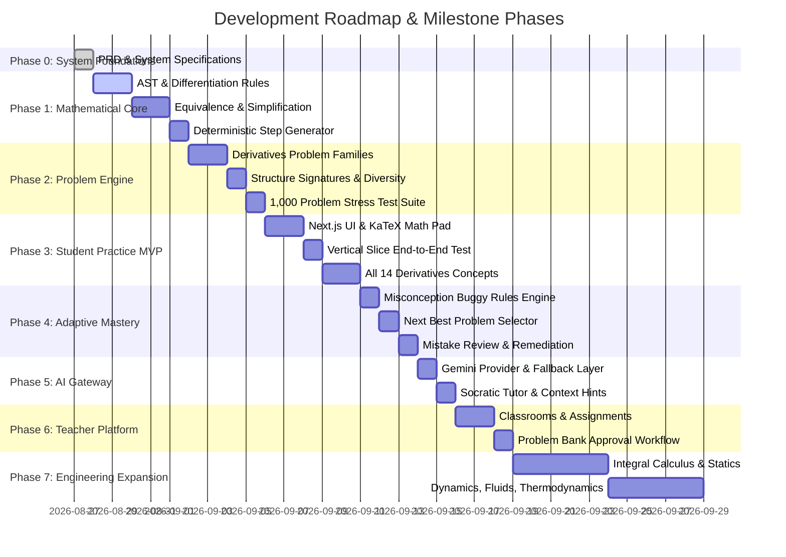

# Engineering Roadmap & Milestones
## Engineering Practice Engine

### Development Roadmap Overview

---

### Milestone 1: Mathematical Core & Vertical Slice (Current Goal)
- **Scope**:
  - Full AST parser & tokenizer for standard calculus syntax ($x^n$, $\sin$, $\cos$, $\tan$, $e^x$, $\ln$, polynomials, fractions).
  - Symbolic differentiation engine implementing Power, Product, Quotient, Chain, Trig, Exp, Log, and Implicit rules.
  - Dual-verification equivalence checker with zero-difference simplification and Schwartz-Zippel multi-point testing.
  - Step-by-step solution and progressive hint generator.
  - Problem family generator for Chain Rule (`CHAIN_POWER_POLYNOMIAL`, `CHAIN_TRIG_INNER`).
  - Interactive Next.js + React web interface with KaTeX rendering, answer checking, progressive hints, step-by-step breakdown, and adaptive retry.
  - Full unit test and golden benchmark test suites.

### Milestone 2: Complete Derivatives Suite (14 Concepts)
- Implementation of all 14 calculus concepts with 3+ problem families each.
- Multi-dimensional difficulty calibrator and diversity signature filter.
- Automated 1,000 problem fuzzing and validation test suite.

### Milestone 3: Mastery & Misconception Engine
- Bayesian/Weighted student mastery calculation.
- Perturbation generator for automatic bug identification.
- "Review My Mistakes" dedicated workspace with targeted remediation practice.

### Milestone 4: AI Tutoring Layer & Teacher Platform
- Gemini-powered Socratic tutoring with strict output validation and solution-leakage guards.
- Teacher assignments, classroom tracking, and problem approval workflows.

### Milestone 5: Future Engineering Subjects
- Modular expansion into Integral Calculus, Differential Equations, Statics, Dynamics, Thermodynamics, and Fluid Mechanics.
